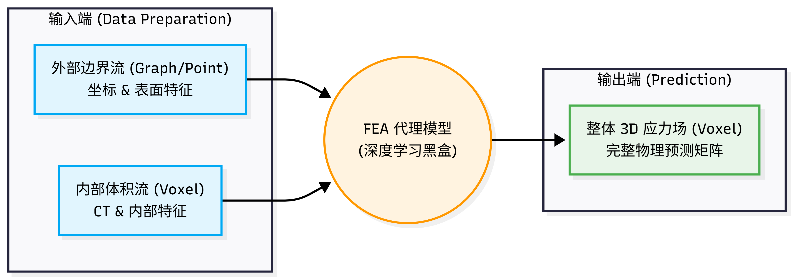

# FEA 深度学习模型模块开发预研报告 (FEA_PRE.md)

## 0. 前言
本报告旨在总结骨科脊柱生物力学有限元（FEA）深度学习预测模块的阶段性研究成果。报告涵盖了输入输出定义、网络架构选型、数据预处理流程及后续优化计划。本模块核心目标是构建一个能够实时预测椎体内部及表面应力场（Stress Field）的高性能 AI 引擎。

---

## 1. 架构演进：讨论历程与最终决策

在模块定义的初期，我们经历了多次逻辑碰撞与方案迭代，最终敲定了目前的“仿生双流”架构：

### 1.1 讨论的曲折过程
* **初期构想（纯体素流）**：最初考虑直接使用 3D CNN 处理原始 CT 矩阵。
    * **反思**：由于骨水泥 HU 值极高且边缘锐利，传统的 3D 卷积核容易产生梯度饱和，且难以区分“皮质骨外壳”与“骨水泥内芯”截然不同的力学性质。
* **中期争论（物理特征的显隐性）**：曾讨论是否让 AI 直接从 CT 学习隐式特征。
    * **结论**：坚决引入显式 FEA 先验。FEA 在本项目中不是简单的“结果”，而是**强迫 AI 理解物理因果律的“高级手段”**。
* **后期权衡（输出端的耦合度）**：在“双流独立输出”与“整体空间重构输出”之间反复纠结。
    * **最终敲定**：采用**整体空间重构输出（Holistic Voxel Reconstruction）**。理由是真实物理世界中的力传导是连续的，通过末端 3D 卷积核跨越边界的感受野，能实现“皮”与“馅”在力学梯度上的 100% 物理耦合。

### 1.2 最终定位
FEA 模块被定义为一个**物理启发式的代理模型（Physics-Informed Surrogate Model）**。它将复杂的非线性偏微分方程求解过程，转化为一个高效率的深度学习推理过程。

---

## 2. 模块输入与输出定义

### 2.1 输入 (Input)
采用**双通道 (Dual-Channel)** 与 **双流 (Dual-Stream)** 的混合输入模式：
* **流 1 (内部体素流 - Voxel Stream)**：
    * 数据：经过形态学剥离后的椎体内部（含松质骨与骨水泥）。
    * 通道：Channel 0 (CT 灰度), Channel 1 (初始力学映射场)。
* **流 2 (外部边界流 - Graph/Point Stream)**：
    * 数据：提取自椎体表层（含终板）的离散坐标点集。
    * 特征：[X, Y, Z, CT值, 表面应力先验]。

### 2.2 输出 (Output)
* **形态**：完整的 3D 应力张量矩阵 ($D \times H \times W$)。
* **物理意义**：每个体素代表该解剖位点在受压状态下的等效应力（Von Mises Stress, MPa）。

---

## 3. 内部架构参考与技术实现

### 3.1 借鉴的优质论文方法
* **通用 AI 领域 (CVPR/NeurIPS)**：
    * **Transolver (2024)**：借鉴其“物理感知 Token”思想，将高应力区域打包为重点关注的注意力单元。
    * **FNO (Fourier Neural Operator)**：参考其加速偏微分方程求解的算子学习思路，提升模型对不同网格分辨率的泛化能力。
* **医学影像领域 (MICCAI/TMI)**：
    * **Swin-UNETR**：利用三维滑动窗口注意力机制，捕捉骨水泥对远端骨骼的应力遮挡效应。
    * **Point-Voxel 融合架构**：借鉴其处理大规模 3D 数据的经验，实现点云特征向体素空间的无损投影。

### 3.2 推荐的内部结构
采用 **“双流特征提取器 + 交叉注意力融合 (Cross-Attention) + 空间重构解码器”**。
* **提取器**：3D ResNet (体素) + PointNet++ (点云)。
* **融合层**：利用表面特征作为 Query 查询内部支撑特征，建立物理关联。

---

## 4. 输入数据构建方法：“剥洋葱”详细流程

为实现解剖学与物理性质的隔离，采用基于形态学的数据分流技术：

1.  **二值化提取 (Binarization)**：设定 HU > 100 阈值，从 CT 原始数据中抠出整个实心椎体（含骨水泥），生成 `Full_Mask`。
2.  **空间腐蚀 (Erosion)**：对 `Full_Mask` 执行 `3D binary_erosion` 操作（迭代次数对应皮质骨厚度）。此步骤**无视内部 HU 值高低**，仅通过几何位置“削去”表层。
3.  **内芯提取 (Core Generation)**：利用腐蚀后的 Mask 与原始影像做乘法，获得仅包含内部松质骨与骨水泥的体素流输入。
4.  **外壳剥离 (Shell Extraction)**：执行 `Full_Mask` 与 `Core_Mask` 的异或操作（XOR），提取出厚度均匀的边界层。
5.  **坐标映射 (Mapping)**：记录边界层体素的空间坐标，转化为点云格式。

---

## 5. 优质 FEA 应力矩阵数据构建 (Ground Truth)

目前的构建流程采用基于 Python 的快速线性力学映射：
* **当前逻辑**：$E(\text{Modulus}) \propto \text{HU}^{1.8}$，基于胡克定律进行体素级显式映射。
* **局限性确认**：当前方法主要捕捉了静态应力分布，对于非线性形变和复杂的边界接触模拟尚不够精细。

---

## 6. 下一步计划 (Next Steps)

1.  **优化优质 FEA 应力矩阵构建方法**：
    * 引入商业有限元软件（如 Abaqus/ANSYS）对部分样本进行高精度全非线性分析，作为金标准校验。
    * 通过对 59 号脚本的物理参数校准，建立更高保真度的“数值仿真预言机（Oracle）”。
2.  **深度学习模型深度调研与选型**：
    * 针对通用 AI 领域（PINNs、Neural Operators）与医学 AI 顶刊（MICCAI 2025 最新趋势）进行二次深度调研。
    * 探索如何将点云卷积（KPConv）与 3D Transformer 结合，进一步提升模型在复杂病理样本（破碎骨折、水泥渗漏）上的预测鲁棒性。

