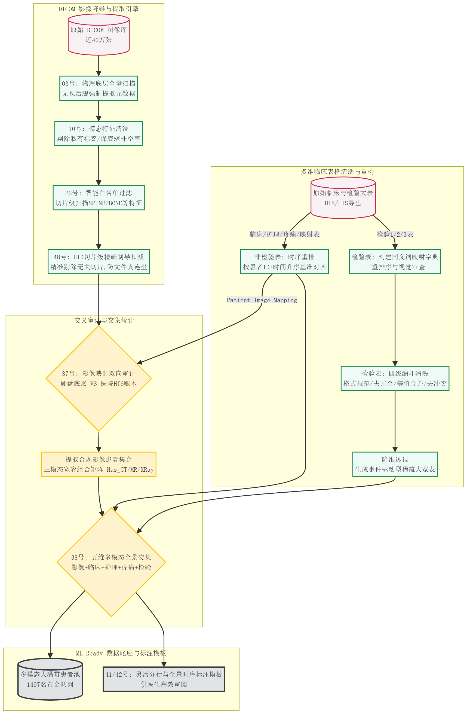

# 🦴 骨科项目数据预处理文档 (Data Preprocessing)

本文档详细记录了本项目中多源异构医疗数据（DICOM 影像与临床长表）的清洗、降维、交叉核验与多模态对齐的全流程工程逻辑。

> 💡 **工程代码导读**：
> 本预处理模块的所有清洗、核验与排版逻辑均已由 Python 脚本自动化实现。各步骤对应的具体脚本文件及运行拓扑关系，请参阅：👉 **[数据预处理脚本功能矩阵 (Script Function Matrix)](./README_Script_Function.md)**

---

## 1. 原始数据集概述 (Raw Datasets)

出于患者隐私与数据安全考量，所有原始数据均存放于受控的本地/服务器安全存储区。

### 1.1 DICOM 图像数据
包含三类核心医学影像模态：**CT**、**MRI**、**XRay**。数据以物理文件夹形式组织，子文件夹名（`MODALITYID`）与病人实体一一映射。

### 1.2 表格临床数据
HIS/LIS 系统导出的原始多维临床业务大表，包含：
* 《骨科一科研统计-患者基本信息学历诊断年龄入院记录病历病案首页费用数据(新增手术记录数据)》
* 《骨科-疼痛评分》
* 《骨科-其余护理评分》
* 《病例信息》
* 三张包含千万级记录的《检验指标大表》

---

## 2. 数据清洗流水线 (Data Cleaning Pipeline)

### 2.1 DICOM 图像文件字段提取与清洗

#### A. 提取有用的核心参数（数据“瘦身”）
原始 DICOM 数据包含数千个自带字段，绝大部分为冗余信息。我们通过以下步骤提纯：
1.  **删掉机器私有标签**：物理删除所有代表特定厂家（如西门子、GE）的私有字段，防止模型学习到设备偏差（Shortcut Learning）。
2.  **设定 5% 留存门槛**：全量快照统计缺失率，只有在所有图片中填写概率 > 5% 的特征才予以保留。既剔除了海量空洞特征，又保住了“X光遮线器坐标”、“MR反转时间”等高价值罕见参数。
3.  **提取空间坐标**：将 3D 空间坐标、图像朝向、像素间距等解析为结构化数值，为后续三维重建与对齐铺路。

#### B. 非胸腰椎数据清洗 (精准靶向过滤)
综合考察四大语义字段：标注部位 `[BodyPartExamined]`、序列描述 `[SeriesDescription]`、检查描述 `[StudyDescription]` 以及接收线圈名称 `[ReceiveCoilName]`。

**1. 脊柱白名单（White List）**
动态多维字段交叉验证，只要目标字段中包含以下任意字符串（忽略大小写），即判定为有效骨科/脊柱数据。

| 关键词集合 | 类别 | 保留理由与临床解析 |
| :--- | :--- | :--- |
| `SPINE, LSPINE, TSPINE, CSPINE, L-S, T-L, L-SPINE, T-SPINE, C-SPINE, T6-L3` | 解剖学英文 | 标准的脊柱及各节段英文缩写，直接证明扫描目标。 |
| `椎, ZHUI, ji zhu` | 解剖学中文/拼音 | 国内医院 PACS 系统特有的拼音或中文输入，精准定位。 |
| `BONE` | CT重建算法 | 骨窗重建算法，观察骨松质、骨皮质细节的绝对核心数据。 |
| `STIR, DIXON` | MR压脂序列 | 短T1反转恢复及水脂分离序列，突出骨髓水肿与隐匿性骨折。 |
| `SAG, COR` | 空间切面 | 矢状面与冠状面，脊柱成像最依赖纵向切面观察序列和椎间盘。 |
| `SPINEARRAY, AIM_SPINE, CTSP_ADAPTER` | MR物理线圈 | 物理约束特征。使用了脊柱专用接收线圈，成像区域必然是脊柱。 |
| `位` | X光投照体位 | “正侧位/斜位”的截断残留，X光全盘为骨科，属于防误杀捞回特征。 |
| `3D_5mm COR_1, 3D_Batch, 3D_3mm SAR_1, 3D_3mm SAR_2` | 3D后处理集 | 工作站基于容积扫描生成的批量三维重组序列。 |
| `1.25mm std/stnd, 5mm std/stnd, 1.5 x 1.0, 1.5 x 1.2` | 物理重建参数 | 经人工抽查确认为高分辨率薄层或标准重组扫描，执行捞回。 |

**2. 脊柱黑名单（Black List）**
在未命中白名单的情况下，触发以下特征的数据将被彻底物理废弃（宁错杀不放过）：

| 关键词集合 | 类别 | 剔除理由与临床解析 |
| :--- | :--- | :--- |
| `LUNG` | CT非骨科算法 | 肺窗重建算法。骨骼严重过曝，细节丢失，严重干扰模型。 |
| `HEAD, BRAIN, CHEST` | 非骨科解剖部位 | 纯颅脑或纯胸部平扫。无骨科诊断价值的废片。 |
| `DOSE REPORT` | 行政记录截图 | 辐射剂量报告截图，无 3D 医学影像矩阵。 |
| `SCREEN SAVE` | 屏幕截图 | 技师操作界面的屏幕捕获，缺乏原始空间坐标。 |
| `PROCESSED IMAGES, 3D_DEFAULT_1` | 非标准后处理 | 经人工拉伸或重组的次生图像，破坏了物理空间一致性。 |
| `3D_CT_VR_VOLREN_COLLECTION_1` | 容积渲染截图 | VR容积渲染彩色表面截图，本质为 2D 照片。 |
| `SCOUT, 2D` | 定位图/低质图 | 扫描前的快速低清定位图，层厚大，无 3D 重建价值。 |
| `tj tj` | 体检杂项 | 常规体检项目，画质和切面通常无法满足骨科要求。 |
| `0915013854, CTN0000049` | 误填流水号 | 技师将流水号或机身号误填，缺乏解剖学依据。 |
| `EMPTY_VALUE, NAN` | 缺失值与盲盒 | 关键语义字段全空，采取“宁可错杀不可放过”原则，防脏数据。 |

---

### 2.2 表格数据清洗与重构

首先对原始中文命名的表格进行了标准化英文重命名（如 `Lab_Results_1`, `Comprehensive_Clinical_Records` 等）。

#### A. 非检验类表格的时序重排
对《患者基本信息及住院记录》、《护理评分》、《疼痛评分》等执行了全局基准对齐：
* **时序重排逻辑**：以 `患者ID` 为第一主键，以 `入院时间`（或评分时间）为第二主键，进行全局升序重排。
* **处理意义**：彻底消除了 HIS 导出时常见的乱序穿插现象，确保同一患者多年记录在物理行上严格按时间线递增，为后续多模态时间轴交织打下地基。

#### B. 检验类表格的深度清洗与降维
针对三张高达千万级的纵向检验流水账（Long Format），执行以下处理：
1. **构建同义词映射大表**：提取所有检验项目，基于“家族频次”与视觉审查，将散落的异名（如“WBC”、“白细胞计数”）强制归口到唯一的标准名称，硬编码输出《检验指标映射规则表》。
2. **四级漏斗式深度清洗 (Data Cleaning Funnels)**：
   * **漏斗一（格式与半定量保留）**：刻意保留了 `<, >, +, -` 等极具危急值诊断权重的特殊符号（如尿蛋白 `+++`），仅清理乱码与不可见字符。
   * **漏斗二（去冗余）**：剔除 ID/结果 为空的无效记录及纯文本提示行。
   * **漏斗三（等值映射）**：调用映射大表，统一 `项目名称` 变量。
   * **漏斗四（致命冲突硬剔除）**：对同人同时刻出现的数值矛盾记录（系统重传 Bug 等）成对物理删除（宁缺毋滥）。
3. **降维透视 (Pivot)**：以 `[患者ID, 报告时间]` 为联合主键，将纵向流水账横向展开为事件驱动型稀疏大宽表（ML-Ready Wide Table）。

---

### 2.3 多模态归纳统计清洗 (Multimodal Intersection)

#### A. DICOM 影像与映射表交集审计
为确保物理数据与医院 HIS/PACS 系统账本的绝对一致性，实施了影像映射双向审计：
* **完美双向交集**：成功实现 **7,721 个** 独立影像文件夹的物理与账单双重印证。
* **异常剥离**：排查并隔离 59 份影像丢失记录，确认 0 份孤儿影像，保证下游数据溯源合法。

#### B. 五维多模态患者交集统计

| 数据维度 | 核心数据源 | 独立患者数 |
| :--- | :--- | :--- |
| **维度一** | 影像映射表 (底层清洗交集后) | 2,735 人 |
| **维度二** | 综合临床记录 | 3,058 人 |
| **维度三** | 化验事件大宽表 | 3,044 人 |
| **维度四** | 护理评估 | 1,578 人 |
| **维度五** | 疼痛评分 | 1,583 人 |
| **大满贯交集** | **五大维度全覆盖** | **1,497 人** |

> 🎯 **大满贯黄金队列**：挖掘出的 1,497 名全覆盖患者，将作为后续多模态融合预后预测模型（如术后再骨折风险综合预测）的核心训练集。

#### C. 三模态图像患者统计与组合矩阵
基于 UID 切片级精准扣减引擎，对三大核心模态的存活率进行了盘点：

**1. 影像切片级存活漏斗统计**

| 影像模态 | 初始切片数量 | 精准剔除切片 (命中黑名单) | 最终存活切片 | 幸存有效文件夹 | 成功匹配患者数 |
| :---: | ---: | ---: | ---: | ---: | ---: |
| **CT** | 379,474 张 | 787 张 | 378,687 张 | 501 个 | **440 人** |
| **MR** | 67,516 张 | 26 张 | 67,490 张 | 1,181 个 | **982 人** |
| **XRay** | 12,162 张 | 0 张 | 12,162 张 | 6,039 个 | **2,641 人** |

**2. 影像模态宽容组合盘点**

| 模态组合类型 | 包含组合 | 患者人数 | 临床与科研价值评估 |
| :--- | :--- | :--- | :--- |
| **单模态基线** | Has_CT | 440 人 | 适用于基础的三维骨骼重建与骨折线检测 |
| | Has_MR | 982 人 | 适用于隐匿性骨折与脊髓/神经根受压评估 |
| | Has_XRay | 2,641 人 | 适用于宏观曲度测量与大规模二维筛查 |
| **双模态交集** | Has_CT_and_MR | 201 人 | 骨骼细节与软组织水肿的双向对照验证 |
| | Has_CT_and_XRay | 418 人 | 2D宏观与3D微观结构的联合辅助诊断 |
| | Has_MR_and_XRay | 901 人 | 软组织病变与整体骨架曲度联合分析 |
| **三模态满贯** | **Has_All_Three** | **192 人** | 极高。满足高清骨窗、软组织评估与全景投照，是执行3D有限元分析与多模态联合诊断的最优底座 |

---

## 3. 数据预处理流程图 (Workflow Diagrams)

以下为本项目核心数据预处理流水线的架构图：

